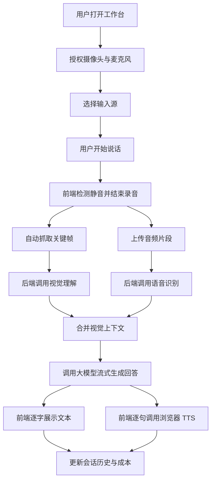

## 1. 产品概述
AI 视觉对话助手是一款基于浏览器运行的全云端多模态助手，支持摄像头、屏幕共享、语音输入、视觉理解、流式回答与浏览器朗读。
- 目标用户是需要快速演示、学习辅导、代码讲解、设备操作辅助和办公陪伴的个人用户、面试官与评审者。
- 产品核心价值是通过一个 URL 即可完成“看见物理世界 + 看见数字世界 + 语音自然对话”的完整体验，突出即时理解、低门槛演示和强感知反馈。

## 2. 核心功能

### 2.1 用户角色
当前版本默认单一角色即可满足目标场景，后续如引入团队协作再扩展权限体系。
| 角色 | 进入方式 | 核心权限 |
|------|----------|----------|
| 演示用户 | 直接打开链接 | 使用摄像头、屏幕共享、语音对话、查看成本、查看历史 |

### 2.2 功能模块
1. **工作台页**：视频预览、输入源切换、语音状态、对话展示、流式回答、TTS 朗读、注意力热区、成本栏。
2. **会话记录页**：会话列表、轮次摘要、视觉缓存摘要、调用明细、费用统计、回放入口。
3. **设置页**：模型配置、API Key 注入方式、设备选择、语音参数、调试开关、缓存策略。

### 2.3 页面详情
| 页面名称 | 模块名称 | 功能描述 |
|-----------|-----------|-----------|
| 工作台页 | 视频主画幅 | 展示摄像头或屏幕共享大画面，支持 AI 注意力框叠加与边框状态脉动 |
| 工作台页 | 自拍小圆窗 | 当共享屏幕时保留摄像头小窗，辅助表达“人 + 屏幕”双视觉状态 |
| 工作台页 | 对话区 | 展示用户与 AI 多轮消息，支持流式逐字输出、当前朗读句高亮与滚动跟随 |
| 工作台页 | 底部状态栏 | 展示聆听波形、思考状态、当前输入源、模型名称和本次调用成本 |
| 工作台页 | 输入控制 | 支持开始/停止麦克风、切换摄像头/屏幕共享、手动重试、重新朗读 |
| 会话记录页 | 会话列表 | 展示历史会话标题、时长、总费用、最近更新时间 |
| 会话记录页 | 轮次详情 | 展示每轮语音文本、视觉摘要、模型回复、调用时间线和费用拆分 |
| 会话记录页 | 回放面板 | 回看某轮对话时的关键帧和对应 AI 回答，方便面试展示 |
| 设置页 | 模型配置 | 配置 ASR、视觉模型、LLM 模型、TTS 策略和流式参数 |
| 设置页 | 设备配置 | 选择麦克风、摄像头、屏幕共享偏好和帧率/抓帧频率 |
| 设置页 | 调试开关 | 开启日志面板、事件追踪、模拟延迟、成本统计明细 |
| 设置页 | 缓存策略 | 配置视觉缓存时长、帧差阈值、静止画面复用策略 |

## 3. 核心流程
用户打开 URL 后进入工作台页，允许浏览器获取摄像头、麦克风或屏幕共享权限。用户开始说话后，前端通过静音检测判断语音结束，并在结束时自动抓取当前关键帧。后端同时调用语音识别与视觉理解，再将识别文本、视觉上下文和会话历史送入大模型生成回答。回答以流式文本形式返回前端，前端逐句展示并调用浏览器 TTS 播报，同时更新当前轮次成本。若用户切换到屏幕共享，则系统保留摄像头小窗并将共享内容作为主要视觉输入。

## 4. 用户界面设计
### 4.1 设计风格
- 主色调：`#0B0E14`、`#111111`，强调色为 `#00F0FF`
- 按钮风格：窄边框、轻微发光、圆角 12px，状态变化以边框与阴影为主
- 字体与字号：中文正文使用现代无衬线，标题使用更窄更克制的展示字体；正文 14px 至 16px，主标题 28px 至 40px
- 布局风格：桌面优先，单页中轴布局，上方大画幅，下方对话区与状态栏
- 图标建议：线性图标、少量几何形，避免彩色插画与重度拟物

### 4.2 页面设计概览
| 页面名称 | 模块名称 | UI 元素 |
|-----------|-----------|-----------|
| 工作台页 | 视频主画幅 | 深色大背景、细边发光框、注意力高亮框、平滑过渡动画 |
| 工作台页 | 对话区 | 半透明毛玻璃面板、AI/用户气泡分层、朗读句高亮、打字光标 |
| 工作台页 | 状态栏 | 青色波形条、思考三点动画、输入源切换按钮、费用徽标 |
| 会话记录页 | 列表区 | 深色卡片、细描边、悬停高亮、费用与时长标签 |
| 会话记录页 | 详情区 | 对话时间线、关键帧缩略图、模型调用摘要、成本分项 |
| 设置页 | 配置面板 | 表单卡片、切换开关、调试说明文本、风险提示文案 |

### 4.3 响应式策略
- 采用桌面优先设计，优先保证 1440px 与 1024px 宽度下的完整演示体验。
- 平板端将视频区与对话区改为纵向堆叠，保留核心功能但弱化高级面板。
- 手机端仅保证基础可访问性，不作为主要演示入口；摄像头、屏幕共享和多面板体验保持降级。
