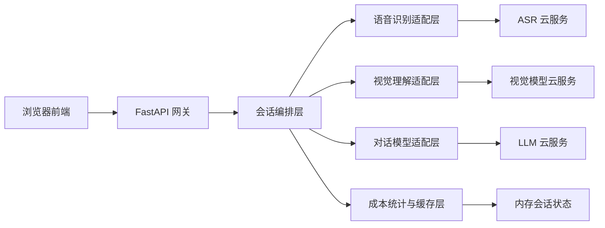
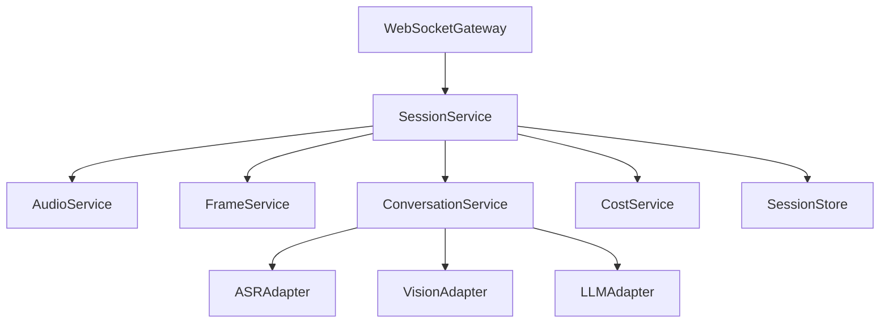
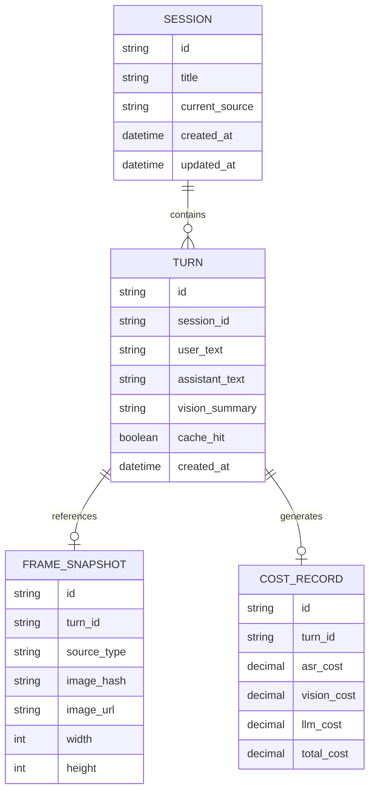

## 1. 架构设计
该项目采用前后端分层的 Web 架构：前端使用 React + shadcn/ui 负责设备采集、画面展示、状态反馈与浏览器内 TTS；后端负责 WebSocket 会话编排、云端模型调用、流式消息分发与成本统计。MVP 阶段不引入数据库，使用内存态会话与可选文件日志降低复杂度；若进入正式上线阶段，再引入 Redis 与 PostgreSQL。



## 2. 技术说明
- 前端：`React 18 + TypeScript + Vite + Tailwind CSS + shadcn/ui + WebSocket + MediaRecorder + getUserMedia + getDisplayMedia + SpeechSynthesis`
- 后端：`Python 3.12 + FastAPI + Uvicorn + WebSocket + httpx + pydantic-settings`
- Python 管理：`uv` 负责 Python 版本、虚拟环境、依赖安装、命令运行
- 配置管理：`.env` + `pydantic-settings`
- 测试方案：`pytest` 用于后端单测，`Playwright` 可选用于核心前端回归
- 部署方式：开发阶段采用 `Vite + FastAPI` 双服务；生产阶段由 FastAPI 托管前端构建产物与 WebSocket
- 存储策略：MVP 默认内存态会话；如进入多人并发阶段，再扩展为 `Redis + PostgreSQL`

## 3. 路由定义
| 路由 | 用途 |
|------|------|
| `/` | React 工作台页，负责主交互、设备接入、语音对话与视觉展示 |
| `/history` | React 会话记录页，查看轮次摘要、视觉缓存与成本统计 |
| `/settings` | React 设置页，配置模型参数、设备偏好、调试开关 |
| `/healthz` | 健康检查接口，用于部署探活 |
| `/ws/session` | WebSocket 会话入口，传递音频、关键帧、状态事件与流式回答 |

## 4. API 定义
后端以 WebSocket 为主通道，HTTP 仅承载页面、探活和未来的历史查询接口。以下为 MVP 阶段核心消息协议。

### 4.1 TypeScript 消息类型
```ts
type ClientEvent =
  | {
      type: "session.start";
      sessionId: string;
      inputSource: "camera" | "screen";
      deviceInfo: { micLabel?: string; cameraLabel?: string };
    }
  | {
      type: "audio.chunk";
      sessionId: string;
      chunkId: string;
      mimeType: string;
      base64Audio: string;
      durationMs: number;
    }
  | {
      type: "frame.capture";
      sessionId: string;
      frameId: string;
      inputSource: "camera" | "screen";
      imageBase64: string;
      width: number;
      height: number;
      capturedAt: string;
    }
  | {
      type: "turn.commit";
      sessionId: string;
      turnId: string;
      silenceMs: number;
      includeVision: boolean;
    }
  | {
      type: "source.switch";
      sessionId: string;
      nextSource: "camera" | "screen";
    };

type ServerEvent =
  | {
      type: "session.ready";
      sessionId: string;
    }
  | {
      type: "asr.result";
      turnId: string;
      transcript: string;
    }
  | {
      type: "vision.result";
      turnId: string;
      summary: string;
      focusRegions: Array<{ x: number; y: number; width: number; height: number; label: string }>;
      cacheHit: boolean;
    }
  | {
      type: "llm.delta";
      turnId: string;
      text: string;
    }
  | {
      type: "llm.done";
      turnId: string;
      fullText: string;
      usage: { inputTokens: number; outputTokens: number };
    }
  | {
      type: "cost.update";
      turnId: string;
      costCny: number;
      breakdown: { asr: number; vision: number; llm: number };
    }
  | {
      type: "error";
      code: string;
      message: string;
    };
```

### 4.2 HTTP 接口预留
| 方法 | 路径 | 用途 |
|------|------|------|
| `GET` | `/api/history` | 查询会话列表，MVP 可先返回空实现或内存态数据 |
| `GET` | `/api/history/{sessionId}` | 查询单个会话详情 |
| `GET` | `/api/config/public` | 获取前端安全可见的模型与功能配置 |

## 5. 服务端架构图
服务端按网关、编排、适配器、状态层拆分，保持后续替换云厂商时影响范围最小。MVP 不设计数据库访问层，因此不会引入 N+1 查询问题；若后续接入会话持久化，将统一通过仓储层批量读取会话、轮次、成本明细，严格避免在循环中逐条查询。



## 6. 数据模型
### 6.1 数据模型定义
MVP 阶段以逻辑模型为主，先保留内存结构；若进入持久化阶段，沿用下述实体定义。



### 6.2 数据定义语言
MVP 默认不启用数据库；以下 DDL 作为进入持久化阶段时的首版参考。若后续落地数据库访问，所有查询必须采用批量查询或预加载，避免 N+1 风险。

```sql
CREATE TABLE sessions (
    id TEXT PRIMARY KEY,
    title TEXT NOT NULL,
    current_source TEXT NOT NULL,
    created_at TIMESTAMP NOT NULL,
    updated_at TIMESTAMP NOT NULL
);

CREATE TABLE turns (
    id TEXT PRIMARY KEY,
    session_id TEXT NOT NULL REFERENCES sessions(id),
    user_text TEXT NOT NULL,
    assistant_text TEXT NOT NULL,
    vision_summary TEXT,
    cache_hit BOOLEAN NOT NULL DEFAULT FALSE,
    created_at TIMESTAMP NOT NULL
);

CREATE INDEX idx_turns_session_id_created_at
ON turns(session_id, created_at DESC);

CREATE TABLE frame_snapshots (
    id TEXT PRIMARY KEY,
    turn_id TEXT NOT NULL REFERENCES turns(id),
    source_type TEXT NOT NULL,
    image_hash TEXT NOT NULL,
    image_url TEXT,
    width INTEGER NOT NULL,
    height INTEGER NOT NULL
);

CREATE INDEX idx_frame_snapshots_turn_id
ON frame_snapshots(turn_id);

CREATE TABLE cost_records (
    id TEXT PRIMARY KEY,
    turn_id TEXT NOT NULL REFERENCES turns(id),
    asr_cost NUMERIC(10, 4) NOT NULL DEFAULT 0,
    vision_cost NUMERIC(10, 4) NOT NULL DEFAULT 0,
    llm_cost NUMERIC(10, 4) NOT NULL DEFAULT 0,
    total_cost NUMERIC(10, 4) NOT NULL DEFAULT 0
);

CREATE INDEX idx_cost_records_turn_id
ON cost_records(turn_id);
```
